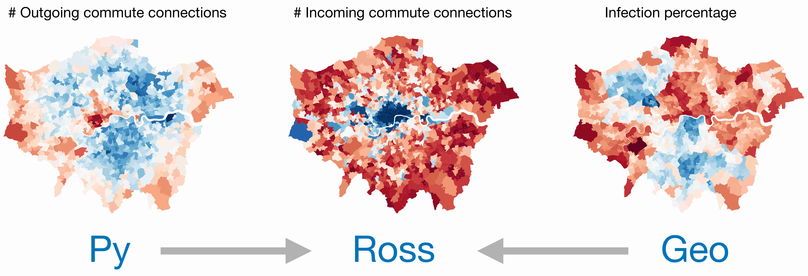

## PyRossGeo: Spatially resolved infectious disease models in Python

[About](#about) | [Model](#model) | [Installation](#installation) | [Documentation](#documentation)  | <!--[Publications](#publications) |--> [License](#license) |  [Contact](#contact)



## About

[PyRossGeo](https://github.com/lukastk/PyRossGeo) is a numerical library for spatially resolved mathematical modelling of infectious diseases. The library has a Python interface, but is coded in C using *Cython*. See below for more details on the model.

[PyRoss](https://github.com/rajeshrinet/pyross) is a companion library that offers tools for both deterministic and stochastic simulation of macroscopic compartmental models, as well as a complete
suite of inference and optimal control tools.

Please open an issue, or join our [public slack](https://join.slack.com/t/pyross/shared_invite/zt-e8th6kcz-S4b_oJIZWPsGLruSPl3Zuw),
if you have any queries, in preference to e-mailing us. For urgent
enquiries, please contact Lukas Kikuchi at [ltk26@cam.ac.uk](ltk26@cam.ac.uk).

The authors are part of the [Rapid Assistance in Modelling the Pandemic (RAMP)](https://royalsociety.org/news/2020/03/urgent-call-epidemic-modelling/) taskforce at the **University of Cambridge**. In alphabetical order, we are:
[Jakub Dolezal](https://github.com/JakubJDolezal),
[Tim Ekeh](https://github.com/tekeh),
[Lukas Kikuchi](https://github.com/lukastk),
[Hideki Kobayashi](https://github.com/hidekb),
[Paul Rohrbach](https://github.com/prohrbach),
[Rajesh Singh](https://github.com/rajeshrinet) and
[Fernando Caballero](https://github.com/Ferfer93).

## Model

The PyRossGeo uses a spatially resolved infectious disease model. The model is distinct from other network-SIR models in that it explicitly considers movement between geographical nodes, by modelling the commuting patterns of the population.

Locally at each geographical node, we simulate compartmental epidemiological dynamics with an age-contact structure. The resident population at each node can move between nodes via the *commuter network*. The epidemics of the commute itself is modelled using the *"commuterverse"*: People moving between geographical nodes must spend the requisite amount of time (corresponding to the distance travelled) with their fellow commuters in a *commuter node*. See the figure below for an example of a commuter network:

<p align="center">
  
</p>

The local infective dynamics at a node-level is customizable, and any variant of the compartmental epidemiological models (e.g. SIR, SEIR, SEAIR, etc.) can be coded using a configuration file.

The model has been tested with synthetic data on London, at an MSOA (Middle Super Output Area) level. We used ~1000 geographical nodes, with a commuter network of ~300'000 edges, constructed using the [2011 UK Census data](https://www.ons.gov.uk/census/2011census). We are currently developing a test for a UK-wide simulation at an LAD (Local Authority District) level.

For a more detailed description of the model, please read [this](https://github.com/lukastk/PyRossGeo/blob/master/docs/model.pdf).

## Installation
Clone (or download) the repository and use a terminal to install using

```bash
>> git clone https://github.com/lukastk/PyRossGeo.git
>> cd pyross
>> python setup.py install
```

PyRossGeo requires the following software

- Python 3.4+
- [Cython 0.25.x+](http://docs.cython.org/en/latest/index.html)
| [NumPy 1.x+](http://www.numpy.org)
| [Pandas](https://pandas.pydata.org/)
| [SciPy 1.1.x+](https://www.scipy.org/)
- Optional dependencies:
| [Zarr](https://zarr.readthedocs.io/) (Saving simulations results)
| [Matplotlib 2.0.x+](https://matplotlib.org) (Example notebooks)
| [Jupyter](https://jupyter.org/) (Example notebooks)
| [PyTest](https://docs.pytest.org/) (Testing)
| [GeoPandas](https://geopandas.org/) (Visualisations)

## Documentation

See <a href="https://github.com/lukastk/PyRossGeo/blob/master/docs/Documentation.md" target="_black">here</a> for documentation, tutorials and example notebooks.

<!--## Publications-->

## License

We believe that openness and sharing improves the practice of science and increases the reach of its benefits. This code is released under the [MIT license](http://opensource.org/licenses/MIT). Our choice is guided by the excellent article on [Licensing for the scientist-programmer](http://www.ploscompbiol.org/article/info%3Adoi%2F10.1371%2Fjournal.pcbi.1002598).

## Contact

For inquiries about PyRossGeo, please join the *#pyrossgeo* channel of our public slack
[here](https://join.slack.com/t/pyross/shared_invite/zt-e8th6kcz-S4b_oJIZWPsGLruSPl3Zuw).
